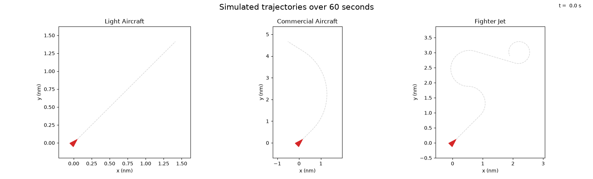
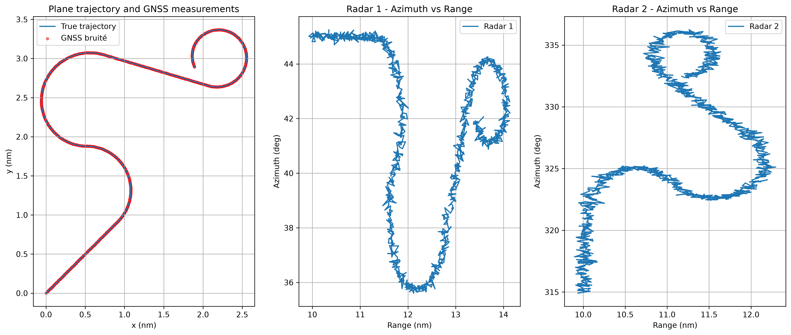

# 2D Aircraft Tracking

Simulation and state estimation of aircraft trajectories using Kalman filtering.

This project studies how different state-space models, sensor configurations and filter parameters affect aircraft tracking performance.

## Objectives

The main objective is to simulate aircraft trajectories and investigate the behavior of Kalman filters under different modeling assumptions.

The project focuses on:

* Comparing different state vectors
* Studying the impact of process and measurement noise
* Comparing different Kalman filter models
* Simulating different sensor configurations
* Evaluating estimation accuracy
* Understanding the effect of filter parameters on tracking performance

## Aircraft scenarios

Three aircraft scenarios are provided:

* Light aircraft
* Commercial aircraft
* Fighter jet



Each scenario has different flight dynamics, including:

* Straight-line flight
* Acceleration and deceleration
* Coordinated turns
* Variable turn rate

## Sensor simulation

Several measurement sources are simulated from the true aircraft trajectory.



### GNSS

Position measurements with Gaussian noise:

* X position
* Y position

### Radar

Two radar sensors provide:

* Range
* Azimuth

The radar measurements are generated from the aircraft position and corrupted with configurable Gaussian noise.

## Kalman filtering

The project investigates different state representations and dynamic models, including:

* Constant Velocity model
* Constant Acceleration model
* Extended Kalman Filter for nonlinear radar measurements
* Rauch-Tung-Striebel smoother

The influence of the following parameters is studied:

* State vector definition
* Process noise covariance
* Measurement noise covariance
* Initial state covariance
* Sensor configuration

## Analysis

The estimated trajectories are compared with the ground truth and the simulated measurements.

The analysis includes:

* Position estimation error
* Velocity estimation error
* RMSE
* Influence of sensor noise
* Influence of process noise
* Comparison between different state models
* Comparison between filtering and smoothing

## Requirements

* Python 3.11
* NumPy
* Matplotlib

## Project structure

```text
2D-aircraft-tracking/
│
├── scenarios.py
├── measurements.py
├── animation.py
├── main.py
│
├── notebooks/
│   └── analysis.ipynb
│
└── README.md
```

## Run

```bash
python main.py
```

## Future work

* Implement and analyse the first Kalman Filter with X = [x]
* Implement and analyse the first Kalman Filter with X = [x, v]
* Implement and analyse the first Kalman Filter with X = [x, v, a]
* Compared to the Filterpy implementation
* Investigate the influence of different parameters on performances
